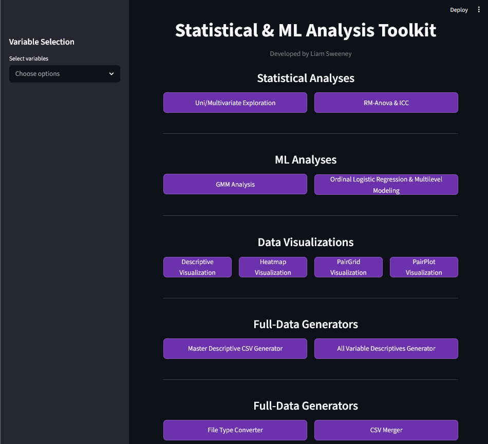

# Statistical ML Analysis Toolkit

A desktop GUI for exploratory data analysis and unsupervised machine learning on quantitative CSV datasets. Built in Python with Tkinter — functions as a free, open-source alternative to SPSS for research data, with an extended ML pipeline for subgroup discovery.

> **Validated on:** Pima Indians Diabetes Dataset, Parkinson's vocal biomarker data, neuroimaging datasets

---



---

## What It Does

Select variables from any CSV dataset using searchable dropdowns, then run any of the following with one click:

| Analysis | What You Get |
|---|---|
| **Descriptive Statistics** | Per-variable and master summary CSVs: mean, median, mode, variance, skew, kurtosis, SE, IQR, frequency counts |
| **Multivariate Exploration** | 5-panel visualization per variable: probability plot, histogram with normal fit, boxplot, violin plot, swarm plot |
| **Multivariate Visualization** | PairGrid with histograms, scatter plots, and KDE; optional grouping variable encoding |
| **Correlational Analysis** | Pearson correlation heatmap and regression pairplot |
| **GMM Analysis** | Full unsupervised ML pipeline — see below |

All outputs save automatically to disk as CSVs and 300 DPI PNGs.
## What It Does

Select variables from any CSV dataset using searchable dropdowns, then run any of the following with one click:

| Analysis | What You Get |
|---|---|
| **Descriptive Statistics** | Per-variable and master summary CSVs: mean, median, mode, variance, skew, kurtosis, SE, IQR, frequency counts |
| **Multivariate Exploration** | 5-panel visualization per variable: probability plot, histogram with normal fit, boxplot, violin plot, swarm plot |
| **Multivariate Visualization** | PairGrid with histograms, scatter plots, and KDE; optional grouping variable encoding |
| **Correlational Analysis** | Pearson correlation heatmap and regression pairplot |
| **GMM Analysis** | Full unsupervised ML pipeline — see below |

All outputs save automatically to disk as CSVs and 300 DPI PNGs.

---

## GMM Pipeline (Quick Summary)

1. **Clean** — Drop NaN rows; replace physiologically impossible zeros with NaN for configurable columns
2. **Standardize** — Z-score all features via `StandardScaler`
3. **LDA check** — 5-fold cross-validated LDA establishes a supervised upper bound before unsupervised clustering
4. **PCA** — Reduce to components explaining ≥ 95% variance; fit all GMMs in PCA space
5. **Model selection** — Fit 40 models (K = 1–10 × 4 covariance types); select best by BIC with 1-std acceptable range
6. **Evaluate** — NMI and ARI against diagnosis labels; row-normalized crosstab heatmap
7. **Export** — CSV with all model selection results, cluster assignments, and alignment metrics
## GMM Pipeline (Quick Summary)

1. **Clean** — Drop NaN rows; replace physiologically impossible zeros with NaN for configurable columns
2. **Standardize** — Z-score all features via `StandardScaler`
3. **LDA check** — 5-fold cross-validated LDA establishes a supervised upper bound before unsupervised clustering
4. **PCA** — Reduce to components explaining ≥ 95% variance; fit all GMMs in PCA space
5. **Model selection** — Fit 40 models (K = 1–10 × 4 covariance types); select best by BIC with 1-std acceptable range
6. **Evaluate** — NMI and ARI against diagnosis labels; row-normalized crosstab heatmap
7. **Export** — CSV with all model selection results, cluster assignments, and alignment metrics

---

## Quickstart
## Quickstart

```bash
git clone https://github.com/Liam-S-Sweeney/Statistical-ML-Analysis-Toolkit.git
cd Statistical-ML-Analysis-Toolkit

python -m venv venv
source venv/bin/activate        # macOS/Linux
venv\Scripts\Activate.ps1       # Windows PowerShell

source venv/bin/activate        # macOS/Linux
venv\Scripts\Activate.ps1       # Windows PowerShell

pip install -r requirements.txt
```

Place your CSV in `data_files/`, update `DATA_PATH` in `config.py`, then:
Place your CSV in `data_files/`, update `DATA_PATH` in `config.py`, then:

```bash
python main_gui.py
```

The tool ships pre-configured for the bundled [Pima Indians Diabetes Dataset](https://raw.githubusercontent.com/plotly/datasets/master/diabetes.csv).
The tool ships pre-configured for the bundled [Pima Indians Diabetes Dataset](https://raw.githubusercontent.com/plotly/datasets/master/diabetes.csv).

---

## Configuration
## Configuration

All parameters live in `config.py`. Update when switching datasets.
All parameters live in `config.py`. Update when switching datasets.

| Parameter | Description |
|---|---|
| `DATA_PATH` | Path to your CSV inside `data_files/` |
| `DX` | Diagnosis / outcome column name (used by GMM for cluster evaluation) |
| `IMPOSSIBLE_ZERO_VARS` | Columns where zero is physiologically impossible — zeros replaced with NaN before GMM |
| `MISSING_CODES` | Numeric missing-data codes (e.g. `-99`, `-999`) — replaced with NaN on load |
| `HUE_COL` / `SIZE_COL` | Grouping columns for PairGrid encoding — set to a non-existent column to disable |

---

## Project Structure

```
Statistical-ML-Analysis-Toolkit/
├── main_gui.py                      # Entry point — Tkinter GUI
├── config.py                        # All configurable parameters
├── data_loader.py                   # CSV loading and missing-code cleaning
├── cdfs.py                          # Descriptive statistics engine
├── impossible_var_cleaner.py        # Zero-imputation and NaN cleaning
├── global_descriptive_generator.py  # Master and per-variable CSV generators
├── multivariate_exploration.py      # Exploration, visualization, correlation
├── gmm_analysis.py                  # Full GMM pipeline
├── data_files/                      # Place dataset here
├── single_var_descriptives/         # Auto-generated per-variable CSVs
├── multivariate_analysis/           # Auto-generated multivariate outputs
└── output_pngs/                     # Auto-generated 300 DPI plots
```

---

## Interpreting GMM Output

| Result | Interpretation |
| `DATA_PATH` | Path to your CSV inside `data_files/` |
| `DX` | Diagnosis / outcome column name (used by GMM for cluster evaluation) |
| `IMPOSSIBLE_ZERO_VARS` | Columns where zero is physiologically impossible — zeros replaced with NaN before GMM |
| `MISSING_CODES` | Numeric missing-data codes (e.g. `-99`, `-999`) — replaced with NaN on load |
| `HUE_COL` / `SIZE_COL` | Grouping columns for PairGrid encoding — set to a non-existent column to disable |

---

## Project Structure

```
Statistical-ML-Analysis-Toolkit/
├── main_gui.py                      # Entry point — Tkinter GUI
├── config.py                        # All configurable parameters
├── data_loader.py                   # CSV loading and missing-code cleaning
├── cdfs.py                          # Descriptive statistics engine
├── impossible_var_cleaner.py        # Zero-imputation and NaN cleaning
├── global_descriptive_generator.py  # Master and per-variable CSV generators
├── multivariate_exploration.py      # Exploration, visualization, correlation
├── gmm_analysis.py                  # Full GMM pipeline
├── data_files/                      # Place dataset here
├── single_var_descriptives/         # Auto-generated per-variable CSVs
├── multivariate_analysis/           # Auto-generated multivariate outputs
└── output_pngs/                     # Auto-generated 300 DPI plots
```

---

## Interpreting GMM Output

| Result | Interpretation |
|---|---|
| **ARI / NMI near 0** | Clusters don't align with diagnostic labels — may reflect that GMM finds density modes, not label boundaries. Cross-reference LDA accuracy. |
| **ARI > 0.2** | Moderate cluster–diagnosis alignment; diagnostic groups occupy partially distinct regions of feature space |
| **Flat BIC curve** | No strong cluster signal — data may not contain separable subpopulations for these features |
| **K = 1 selected** | Single density mode; consider different feature selection |
| **High LDA, low ARI** | Features are linearly separable under supervision but do not form natural density clusters |
| **ARI / NMI near 0** | Clusters don't align with diagnostic labels — may reflect that GMM finds density modes, not label boundaries. Cross-reference LDA accuracy. |
| **ARI > 0.2** | Moderate cluster–diagnosis alignment; diagnostic groups occupy partially distinct regions of feature space |
| **Flat BIC curve** | No strong cluster signal — data may not contain separable subpopulations for these features |
| **K = 1 selected** | Single density mode; consider different feature selection |
| **High LDA, low ARI** | Features are linearly separable under supervision but do not form natural density clusters |

---

## Requirements

```
pandas numpy matplotlib seaborn scipy statsmodels scikit-learn imbalanced-learn requests
```
pandas numpy matplotlib seaborn scipy statsmodels scikit-learn imbalanced-learn requests
```
